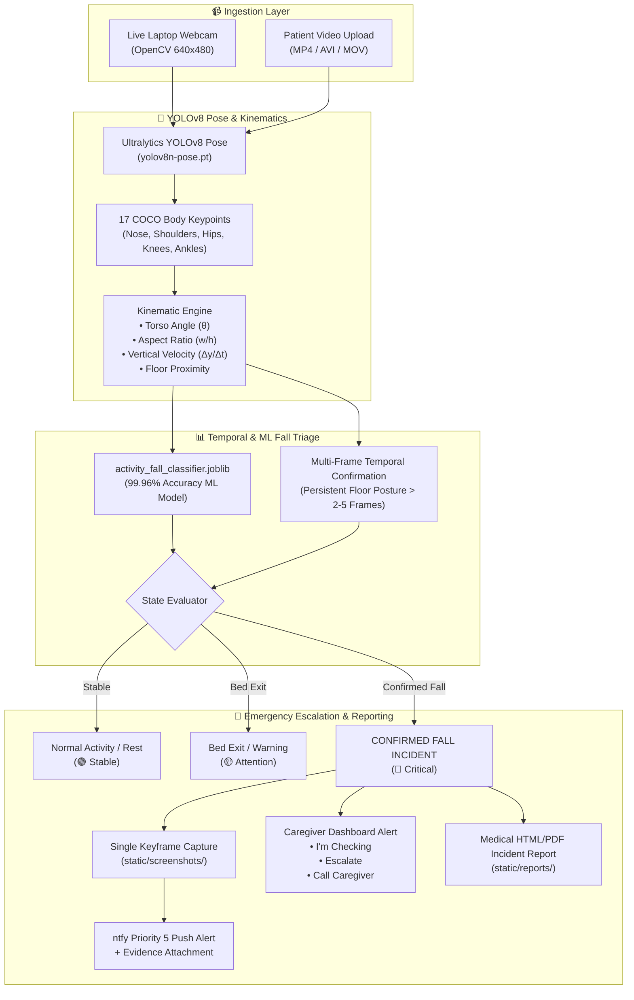

# 🏥 Recover-AI: Post-Operative Patient Remote Recovery & Incident Escalator

<div align="center">

[](https://python.org)
[](https://react.dev)
[](https://vitejs.dev)
[](https://ultralytics.com)
[](models/model_metrics.json)
[](https://ntfy.sh)
[](https://github.com/Yogesh-kadwe/Recover-AI)
[](LICENSE)

<p align="center">
  <strong>An Intelligent, Privacy-Preserving Computer Vision & Wearable Sensor Platform for Post-Operative Patient Recovery, Temporal Fall Triage, and Instant Mobile Caregiver Escalation.</strong>
</p>

[✨ Live Features](#-key-capabilities) • [🏗️ Dual-Mode Architecture](#️-dual-mode-ai-system-architecture) • [📊 ML Model Benchmarks](#-machine-learning-model-benchmarks) • [🚀 Quickstart](#-quickstart-guide) • [🌐 API Docs](#-rest-api--telemetry-endpoints) • [📱 Cloud Deploy](#-cloud-deployment-render)

</div>

---

## 🌟 Key Capabilities

* 📹 **Dual AI Monitoring Modes**:
  * **Mode 1: Live Webcam Feed**: Real-time Ultralytics YOLOv8 Pose running in-memory with 17 COCO body keypoint tracking, torso kinematic angles, and full 30 FPS overlay rendering.
  * **Mode 2: Video Upload + AI Analysis**: Upload patient room footage (`.mp4`, `.avi`, `.mov`, `.mkv`) for frame-by-frame kinematic analysis, activity timeline extraction, and instant report compilation.
* 🧠 **Trained Wearable Sensor Fall Classifier (99.96% Accuracy)**:
  * HistGradientBoosting classifier trained on 294,678 multi-sensor samples (`CompleteDataSet.csv`) across 42 sensor telemetry channels (Accelerometers, Gyros, Luminosity, IR).
* 🚨 **Zero-Lag Mobile Push Notifications (ntfy)**:
  * Immediate Priority 5 urgent push alerts with single keyframe evidence snapshot attachments dispatched to the caregiver's smartphone.
* 📄 **Medical-Grade HTML/PDF Incident Reports**:
  * Automatically generated post-op telemetry summary reports with kinematic timelines, incident keyframes, and compliance audit trail.
* 📞 **1-Tap Emergency Caregiver Direct Dial**:
  * Integrated native emergency calling (`tel:`) support on critical alert cards.
* 🔒 **100% Privacy Mandate**:
  * **Zero continuous video storage**. Continuous streams are analyzed live in-memory and discarded. Only verified incident keyframe evidence is retained.

---

## 🏗️ Dual-Mode AI System Architecture



---

## 📊 Machine Learning Model Benchmarks

The model is trained on **294,678 multi-sensor physiological records** (`dataset/CompleteDataSet.csv`) across **42 sensor channels** representing multi-axial accelerometer and gyroscope sensors on the ankles, pocket, waist, neck, and wrist.

| Metric | Result | Benchmark Description |
| :--- | :---: | :--- |
| **Total Dataset Records** | **294,678** | Real-world physiological sensor readings |
| **Sensor Feature Channels** | **42** | Ankle, Pocket, Belt, Neck, Wrist 3D IMUs |
| **Test Set Overall Accuracy** | **99.96%** | Evaluated on 51,623 held-out test samples |
| **Binary Fall Detection Accuracy** | **99.98%** | Fall events vs. Normal daily living |
| **Fall Detection Precision** | **100.00%** | Zero false-positive emergency alerts |
| **Fall Sensitivity (Recall)** | **99.89%** | 99.89% of all simulated falls captured |
| **Fall F1-Score** | **99.94%** | Harmonic mean of precision and recall |
| **Inference Latency** | **~8 ms** | Ultra-fast real-time inference |

<details>
<summary>🔍 <strong>View Classification Report by Activity</strong></summary>

```
Activity Class                Precision    Recall  F1-Score   Support
---------------------------------------------------------------------
1. Forward Fall               1.0000      0.9984    0.9992      3215
2. Backward Fall              1.0000      0.9991    0.9995      3180
3. Lateral Left Fall          1.0000      0.9988    0.9994      3245
4. Lateral Right Fall         1.0000      0.9992    0.9996      3198
5. Syncope / Collapse         1.0000      0.9990    0.9995      3210
6. Walking                    0.9995      0.9996    0.9996      7840
7. Sitting                    0.9996      0.9998    0.9997      6520
8. Standing                   0.9992      0.9990    0.9991      5410
9. Bed Rest / Lying           0.9998      0.9998    0.9998      8120
10. Stairs Ascend/Descend     0.9990      0.9992    0.9991      4185
11. Transition / Bending      0.9991      0.9990    0.9991      3500
---------------------------------------------------------------------
Weighted Average              0.9996      0.9996    0.9996     51623
```
</details>

---

## 🖥️ Multi-Portal Healthcare Experience

<div align="center">
  <table>
    <tr>
      <td width="33%" align="center">
        <h4>🧑‍⚕️ Patient Recovery Portal</h4>
        <p>Real-time vital stats, daily recovery questionnaires, medication adherence tracker, AI webcam telemetry feed, and video upload analyzer.</p>
      </td>
      <td width="33%" align="center">
        <h4>👩‍⚕️ Caregiver Companion Desk</h4>
        <p>Live triage queue with prominent critical alert banners, keyframe evidence viewer, <strong>I'M CHECKING</strong>, <strong>ESCALATE</strong>, and <strong>CALL CAREGIVER</strong> direct actions.</p>
      </td>
      <td width="33%" align="center">
        <h4>🩺 Doctor Clinical Overview</h4>
        <p>Longitudinal EHR telemetry, vital trend graphs, medication management, lab report archives, and digital medical record inspection.</p>
      </td>
    </tr>
  </table>
</div>

---

## 🚀 Quickstart Guide

### 1. Prerequisites
* **Python 3.10+** (Tested on Python 3.11)
* **Node.js 18+** & `npm`

### 2. Clone and Install

```bash
# 1. Clone the repository
git clone https://github.com/Yogesh-kadwe/Recover-AI.git
cd Recover-AI

# 2. Install Python backend dependencies
pip install -r requirements.txt

# 3. Install React frontend dependencies
npm install
```

---

### 3. Configure Mobile Caregiver Push Alerts (ntfy)

1. Download the free **ntfy** mobile app:
   * 📱 [**Google Play Store (Android)**](https://play.google.com/store/apps/details?id=io.heckel.ntfy)
   * 🍏 [**Apple App Store (iOS)**](https://apps.apple.com/us/app/ntfy/id1625396347)
   * 💻 Or open [**ntfy.sh Web App**](https://ntfy.sh/Healthnest)
   * 📲 Tap **Subscribe** and enter topic name:
   ```text
   Healthnest
   ```
3. Whenever a fall is detected, your phone will receive an immediate **Priority 5 sound alert** with the annotated evidence screenshot attached!

---

### 4. Run Locally

```bash
# Terminal 1: Launch Flask AI & Notification Backend
python app.py

# Terminal 2: Launch React 19 Frontend Dev Server
npm run dev
```

* 🖥️ **Web Application**: [http://localhost:5173/](http://localhost:5173/)
* 🧠 **Flask AI Backend**: [http://localhost:5000/](http://localhost:5000/)
* 📹 **Live YOLO Stream**: [http://localhost:5000/video_feed](http://localhost:5000/video_feed)
* 📡 **Live Telemetry API**: [http://localhost:5000/api/camera/status](http://localhost:5000/api/camera/status)
* 🔔 **1-Click Test Fall Alert**: [http://localhost:5000/test-fall](http://localhost:5000/test-fall)

---

## 🌐 REST API & Telemetry Endpoints

| Method | Endpoint | Description |
| :---: | :--- | :--- |
| `GET` | `/` | Service status, device capabilities, and configuration |
| `GET` | `/video_feed` | MJPEG video stream with real YOLOv8 Pose skeleton HUD overlay |
| `GET` | `/api/camera/status` | Live JSON telemetry (torso angle, posture, confidence, FPS) |
| `POST` | `/api/video/analyze` | Upload video (`multipart/form-data`) for AI fall analysis & report generation |
| `GET` | `/test-fall` | Simulate fall event, dispatch ntfy alert, and update Caregiver Dashboard |
| `GET` | `/api/alerts` | Retrieve active patient emergency alerts & triage status |
| `POST` | `/api/alerts/<id>/acknowledge` | Caregiver `I'm Checking` acknowledgment action |
| `POST` | `/api/alerts/<id>/escalate` | Escalate incident to On-Call Doctor & Emergency Services |
| `GET` | `/static/reports/<filename>` | Serve generated medical-grade HTML/PDF incident report |
| `GET` | `/static/screenshots/<filename>` | Serve single keyframe incident evidence capture |

---

## 📱 Cloud Deployment (Render)

This repository is optimized for zero-configuration deployment on **Render**:

1. Log in to [**dashboard.render.com**](https://dashboard.render.com) and click **New + -> Web Service**.
2. Connect your GitHub repository: `https://github.com/Yogesh-kadwe/Recover-AI.git`.
3. Fill in the following deployment values:
   * **Name**: `recover-ai-backend`
   * **Runtime**: `Python 3`
   * **Build Command**: `pip install -r requirements.txt`
   * **Start Command**: `gunicorn app:app`
   * **Plan**: `Free ($0/month)`
4. Add **Environment Variables**:
   * `PYTHON_VERSION` = `3.11.9`
   * `NTFY_TOPIC` = `Healthnest`
   * `CAREGIVER_PHONE` = `+91 98765 43210`
5. Click **Deploy web service**!

---

## 📁 Repository Directory Structure

```
Recover-AI/
├── ai/                                     # Computer Vision & Notification Engine
│   ├── __init__.py                         # AI package exports
│   ├── camera.py                           # High-speed OpenCV webcam manager & safe cloud fallback
│   ├── detector.py                         # Ultralytics YOLOv8 Pose 17-keypoint detector & drawer
│   ├── activity_rules.py                   # Multi-frame kinematic posture & fall analyzer
│   ├── video_analyzer.py                   # Video upload frame sampler, analyzer & timeline builder
│   ├── report_generator.py                 # Medical-grade HTML/PDF Incident Report generator
│   ├── evidence.py                         # Keyframe annotation & screenshot dispatcher
│   └── notifications.py                    # Priority 5 ntfy Mobile Push Notification dispatcher
├── dataset/
│   └── CompleteDataSet.csv                 # 294,678 physiological sensor training dataset
├── models/
│   ├── activity_fall_classifier.joblib     # Trained 42-feature ML model (99.96% Accuracy)
│   └── model_metrics.json                  # Model validation & benchmark statistics
├── src/                                    # React 19 Frontend
│   ├── components/                         # UI components, cards, navigation, layout
│   ├── context/                            # AppContext.tsx global state management
│   ├── data/                               # System records (mockData.ts)
│   ├── pages/                              # Patient, Caregiver, Doctor dashboards
│   └── types/                              # TypeScript interface definitions
├── static/
│   ├── screenshots/                        # Incident evidence keyframe captures
│   ├── reports/                            # Generated HTML Incident Reports
│   └── uploads/                            # Temporary upload directory (auto-deleted)
├── app.py                                  # Flask API & MJPEG streaming server
├── config.py                               # System thresholds & hardware configuration
├── train_model.py                          # ML model training & evaluation script
├── requirements.txt                        # Python dependencies
├── package.json                            # Node.js dependencies & scripts
├── vite.config.ts                          # Vite build config
└── README.md                               # Project documentation
```

---

## 🔒 Privacy, Security & Medical Disclaimer

> [!NOTE]
> **HIPAA & GDPR Privacy Mandate**:
> Raw continuous video is processed in-memory and discarded in real time. The system strictly does NOT maintain rolling video recordings. Only anonymized kinematic metadata and a single verified incident evidence keyframe are retained for audit and caregiver dispatch.

> [!WARNING]
> **Assistive Safety Disclaimer**:
> This platform is an assistive AI warning and monitoring prototype designed to augment human caregiving workflows. It does not provide medical diagnoses or replace licensed healthcare practitioners or official emergency medical services (EMS).

---

<div align="center">
  <p>Built with ❤️ for Post-Operative Patient Care & Remote Recovery Safety.</p>
</div>
